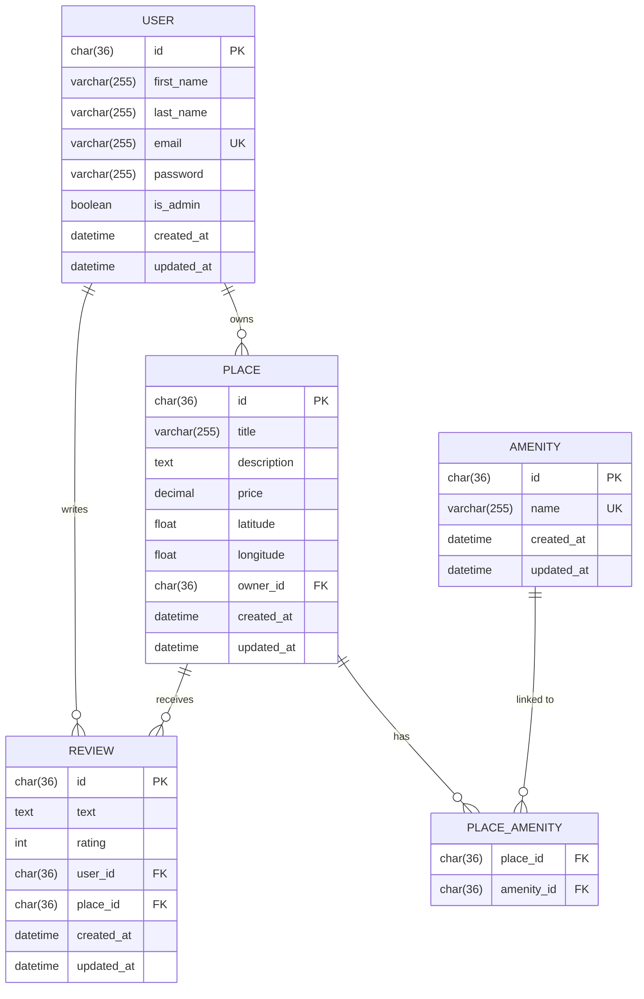

# HBnB — AirBnB Clone
 
A RESTful API built with Python and Flask, inspired by AirBnB. This part introduces JWT-based authentication, role-based access control, and a SQLite database via SQLAlchemy, replacing the in-memory storage used in previous parts.
 
---
 
## Project Structure
 
```
part3/
├── app/
│   ├── __init__.py            # Flask app factory (bcrypt, JWT, SQLAlchemy)
│   ├── api/
│   │   ├── __init__.py
│   │   └── v1/
│   │       ├── __init__.py
│   │       ├── auth.py        # Login endpoint — returns JWT token
│   │       ├── users.py       # User endpoints
│   │       ├── places.py      # Place endpoints
│   │       ├── reviews.py     # Review endpoints
│   │       └── amenities.py   # Amenity endpoints
│   ├── models/
│   │   ├── __init__.py
│   │   ├── base.py            # BaseModel (SQLAlchemy, id / created_at / updated_at)
│   │   ├── user.py            # User model (bcrypt password hashing)
│   │   ├── place.py           # Place model + place_amenity association table
│   │   ├── review.py          # Review model
│   │   └── amenity.py         # Amenity model
│   ├── services/
│   │   ├── __init__.py        # Facade singleton
│   │   └── facade.py          # HBnBFacade — single entry point between API and DB
│   └── persistence/
│       ├── __init__.py
│       └── repository.py      # SQLAlchemyRepository + UserRepository
├── sql/
│   ├── schema.sql             # Full database schema (tables + constraints)
│   └── initial_data.sql       # Admin user + default amenities seed data
├── run.py                     # Application entry point
├── config.py                  # Environment configuration
├── requirements.txt           # Python dependencies
└── README.md
```
 
---
 
## Architecture
 
The project follows a **3-layer architecture**:
 
- **Presentation layer** (`api/`) — Flask-RESTX namespaces handle HTTP requests and responses. Protected endpoints use `@jwt_required()` from flask-jwt-extended.
- **Business logic layer** (`models/`) — SQLAlchemy ORM models for User, Place, Review, and Amenity, all inheriting from `BaseModel`. Input validation lives here.
- **Persistence layer** (`persistence/`) — `SQLAlchemyRepository` implements generic CRUD via SQLAlchemy. `UserRepository` extends it with email-based lookup.
 
Communication between layers goes through the **Facade pattern** (`services/facade.py`), which is the single entry point between the API and the underlying models and repositories.
 
---
 
## Database
 
### Schema
 
The database uses **SQLite** in development (`instance/development.db`), managed through Flask-SQLAlchemy.
 
| Table | Description |
|---|---|
| `users` | Registered users, with hashed password and `is_admin` flag |
| `places` | Places listed by users, with geolocation and pricing |
| `reviews` | Reviews left by users on places they don't own |
| `amenities` | Available amenities (WiFi, Pool…) |
| `place_amenity` | Many-to-many association between places and amenities |
 
### ER Diagram
 

 
### Initialization
 
To create the tables and seed the database with the default admin user and amenities:
 
```bash
flask shell
>>> from app import db
>>> db.create_all()
>>> exit()
 
sqlite3 instance/development.db < sql/initial_data.sql
```
 
The seed data inserts:
- **Admin user** — `admin@hbnb.io` / `admin1234` (fixed UUID `36c9050e-ddd3-4c3b-9731-9f487208bbc1`)
- **Amenities** — WiFi, Swimming Pool, Air Conditioning
 
---
 
## Authentication
 
The API uses **JWT (JSON Web Tokens)** via flask-jwt-extended. To access protected endpoints, first obtain a token via `POST /api/v1/auth/login`, then pass it in the `Authorization` header as `Bearer <token>`.
 
Tokens carry two claims:
- `identity` — the user's UUID
- `is_admin` — boolean flag for role-based access
 
### Access control summary
 
| Endpoint | Public | Authenticated user | Admin only |
|---|---|---|---|
| `GET /api/v1/places/` | ✅ | | |
| `GET /api/v1/places/<id>` | ✅ | | |
| `GET /api/v1/users/` | ✅ | | |
| `GET /api/v1/users/<id>` | ✅ | | |
| `GET /api/v1/reviews/` | ✅ | | |
| `GET /api/v1/amenities/` | ✅ | | |
| `POST /api/v1/auth/login` | ✅ | | |
| `POST /api/v1/places/` | | ✅ (sets owner automatically) | |
| `PUT /api/v1/places/<id>` | | ✅ (owner only) | ✅ (bypass) |
| `POST /api/v1/reviews/` | | ✅ (not own place, once per place) | |
| `PUT /api/v1/reviews/<id>` | | ✅ (author only) | ✅ (bypass) |
| `DELETE /api/v1/reviews/<id>` | | ✅ (author only) | ✅ (bypass) |
| `PUT /api/v1/users/<id>` | | ✅ (own data, no email/pwd) | ✅ (any user, incl. email/pwd) |
| `POST /api/v1/users/` | | | ✅ |
| `POST /api/v1/amenities/` | | | ✅ |
| `PUT /api/v1/amenities/<id>` | | | ✅ |
 
---
 
## Getting Started
 
### Prerequisites
 
- Python 3.8 or higher
- pip
 
### Installation
 
```bash
git clone https://github.com/your-username/hbnb.git
cd hbnb/part3
pip install -r requirements.txt
```
 
### Running the application
 
```bash
python run.py
```
 
The API will be available at `http://127.0.0.1:5000`.  
Swagger UI (interactive docs): `http://127.0.0.1:5000/api/v1/`
 
---
 
## cURL Examples
 
### Login and get a token
 
```bash
curl -X POST "http://127.0.0.1:5000/api/v1/auth/login" \
  -H "Content-Type: application/json" \
  -d '{"email": "admin@hbnb.io", "password": "admin1234"}'
```
 
```json
{ "access_token": "<your_token>" }
```
 
### Create a place (authenticated)
 
```bash
curl -X POST "http://127.0.0.1:5000/api/v1/places/" \
  -H "Content-Type: application/json" \
  -H "Authorization: Bearer <your_token>" \
  -d '{
    "title": "Cozy Studio",
    "description": "Near city center",
    "price": 80,
    "latitude": 48.8566,
    "longitude": 2.3522,
    "amenities": ["<AMENITY_ID>"]
  }'
```
 
### Create a review (authenticated)
 
```bash
curl -X POST "http://127.0.0.1:5000/api/v1/reviews/" \
  -H "Content-Type: application/json" \
  -H "Authorization: Bearer <your_token>" \
  -d '{"text": "Great place!", "rating": 5, "place_id": "<PLACE_ID>"}'
```
 
### Create a user (admin only)
 
```bash
curl -X POST "http://127.0.0.1:5000/api/v1/users/" \
  -H "Content-Type: application/json" \
  -H "Authorization: Bearer <admin_token>" \
  -d '{
    "first_name": "Jane",
    "last_name": "Doe",
    "email": "jane.doe@example.com",
    "password": "secret123"
  }'
```
 
---
 
## API Endpoints
 
| Resource | Method | Endpoint | Auth | Description |
|---|---|---|---|---|
| Auth | POST | `/api/v1/auth/login` | — | Get a JWT token |
| Users | GET | `/api/v1/users/` | — | List all users |
| Users | POST | `/api/v1/users/` | Admin | Create a user |
| Users | GET | `/api/v1/users/<id>` | — | Get a user by ID |
| Users | PUT | `/api/v1/users/<id>` | JWT | Update a user |
| Places | GET | `/api/v1/places/` | — | List all places |
| Places | POST | `/api/v1/places/` | JWT | Create a place |
| Places | GET | `/api/v1/places/<id>` | — | Get a place by ID |
| Places | PUT | `/api/v1/places/<id>` | JWT | Update a place (owner/admin) |
| Reviews | GET | `/api/v1/reviews/` | — | List all reviews |
| Reviews | POST | `/api/v1/reviews/` | JWT | Create a review |
| Reviews | GET | `/api/v1/reviews/<id>` | — | Get a review by ID |
| Reviews | PUT | `/api/v1/reviews/<id>` | JWT | Update a review (author/admin) |
| Reviews | DELETE | `/api/v1/reviews/<id>` | JWT | Delete a review (author/admin) |
| Amenities | GET | `/api/v1/amenities/` | — | List all amenities |
| Amenities | POST | `/api/v1/amenities/` | Admin | Create an amenity |
| Amenities | GET | `/api/v1/amenities/<id>` | — | Get an amenity by ID |
| Amenities | PUT | `/api/v1/amenities/<id>` | Admin | Update an amenity |
 
---
 
## Dependencies
 
```
flask
flask-restx
Flask-Bcrypt
flask-jwt-extended
sqlalchemy
flask-sqlalchemy
```
 
Install with:
```bash
pip install -r requirements.txt
```
 
---
 
## Authors
 
Nicolas DA SILVA (NicolasDS83600)  
Joshua BURLE (Joshuaburle)  
~~Alexandre GUILLAMON (AlexandreG83)~~